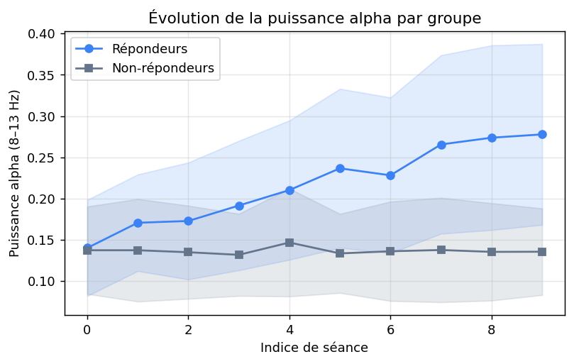
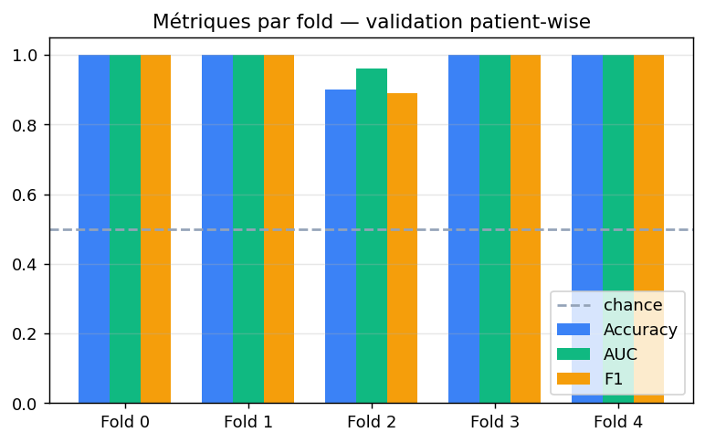
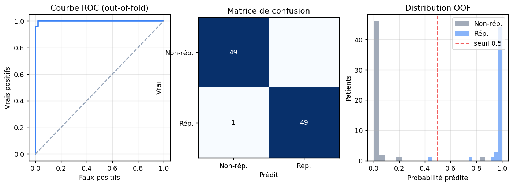

# Recherche-App — rTMS + LSTM (PFE 2026)

Research prototype that predicts patient response to **rTMS** treatment from
simulated neurophysiological signals (EEG / fNIRS / EMG) and clinical scores,
using an **LSTM** model with patient-wise cross-validation.

Built from the design document `Description et Conception (Version0) (3).docx`
— every UML class in the doc is implemented and exercised by tests or the app.

## Status

| Phase | Description | Status |
|-------|-------------|--------|
| 1 | Foundation: domain classes, SQLite persistence, tests | done |
| 2 | Simulated dataset (100 patients × 10 sessions × 128-pt EEG) | done |
| 3 | Preprocessing pipeline (filtering, features, windowing) | done |
| 4 | LSTM training + patient-wise cross-validation | done |
| 5 | Streamlit clinician interface | done |
| 6 | Results notebook, figures, lint clean-up | done |

**32/32 tests passing**, lint clean (`ruff check`), three executable notebooks,
working Streamlit app, generated PDF reports.

## Quick start

```powershell
python -m venv .venv
.\.venv\Scripts\Activate.ps1

pip install -r requirements.txt
# torch wheel comes from a separate index:
pip install torch --index-url https://download.pytorch.org/whl/cpu

python -m pytest -q                       # run tests
python -m src.data.simulator              # generate the simulated dataset
python -m src.data.seeder                 # (optional) load it into SQLite
streamlit run src/app/main.py             # launch the clinician app
```

Then open <http://localhost:8501> and click *Initialiser avec les données simulées*.

## Notebooks

| Notebook | Purpose |
|----------|---------|
| `notebooks/01_data_exploration.ipynb` | Visualize the simulated dataset (signals, labels, alpha trajectory) |
| `notebooks/02_model_training.ipynb`   | Train the LSTM with patient-wise 5-fold CV, save final weights |
| `notebooks/03_results_analysis.ipynb` | All figures for the PFE report — ROC, confusion matrix, OOF distribution, feature importance |

## Figures

Regenerate from the latest weights with `python -m src.reporting.figures` →
output in `docs/figures/`.





## Repository layout

```
src/
  domain/         # the 8 UML classes (Patient, SessionRTMS, ...)
  data/           # simulator, loader, DB seeder
  preprocessing/  # filters, features, windowing, end-to-end pipeline
  models/         # PyTorch LSTM + patient-wise CV trainer
  db/             # SQLAlchemy schema + Repository (= BaseDeDonnées UML class)
  app/            # Streamlit clinician app (4 pages)
  reporting/      # static figure generator for the report
notebooks/        # 01 exploration, 02 training, 03 results
tests/            # pytest — 32 tests
data/             # simulated NPZ + trained model weights (gitignored)
docs/figures/     # README / report figures
```

## UML → code mapping

| UML class                | Module                                            |
|--------------------------|---------------------------------------------------|
| Patient                  | `src/domain/patient.py`                           |
| SessionRTMS              | `src/domain/session_rtms.py`                      |
| SignalNeurophysiologique | `src/domain/signal_neuro.py`                      |
| Preprocessing            | `src/domain/preprocessing.py` (+ `src/preprocessing/`) |
| RTMSParameters           | `src/domain/rtms_parameters.py`                   |
| ModeleLSTM               | `src/domain/lstm_model.py` (+ `src/models/`)      |
| Prediction               | `src/domain/prediction.py`                        |
| ClinicianInterface       | `src/domain/clinician.py` + Streamlit app         |
| BaseDeDonnées            | `src/db/repository.py` (SQLAlchemy + SQLite)      |

## Stack

- **Python 3.11+** (tested on 3.14)
- **PyTorch (CPU)** — TensorFlow doesn't ship Python 3.14 wheels; the doc accepts either
- **SQLAlchemy 2.0** + **SQLite** for persistence
- **Streamlit** + **Plotly** for the clinician UI
- **reportlab** for PDF export
- **scikit-learn** for `GroupKFold` + metrics
- **scipy** for signal filtering (Butterworth bandpass) and PSD (Welch)

## Honest note on the metrics

CV metrics on the simulated dataset reach AUC ≈ 0.99 / accuracy ≈ 0.98. This is
**artificially high** — the simulator deliberately injects a clean alpha-power
biomarker for responders so that the pipeline is testable end-to-end. On real
EEG/fNIRS data, expect AUC in the 0.6–0.75 range *if* the underlying biomarker
exists. The numbers prove the pipeline works (data → preprocessing → model →
metrics with no leakage), not clinical performance. The `03_results_analysis`
notebook says this explicitly.

## User guide

A step-by-step user guide with screenshots is available at
`docs/Guide_Utilisateur.docx`. Regenerate it (after a UI change) with:

```powershell
python -m src.data.seeder                                      # ensure DB has demo data
streamlit run src/app/main.py --server.port 8765 --server.headless true   # in another shell
python -m src.reporting.capture_screens                        # capture PNGs via Playwright
python -m src.reporting.user_guide                             # rebuild the DOCX
```

## Troubleshooting

- **`tensorflow` install fails**: this is expected on Python 3.14. The project
  uses PyTorch instead — see the install command above.
- **Streamlit page shows "Aucun modèle entraîné"**: go to the Training page
  and click "Entraîner et sauvegarder le modèle final", or run the
  `02_model_training` notebook end-to-end.
- **`scipy.signal.welch` warns about `nperseg > len(x)`**: only happens if you
  feed very short windows. Defaults are safe (128 samples).
