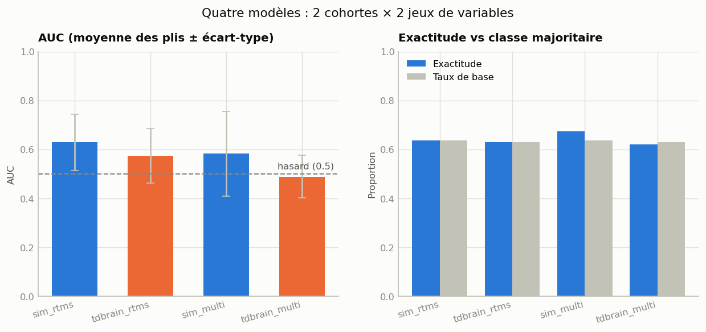
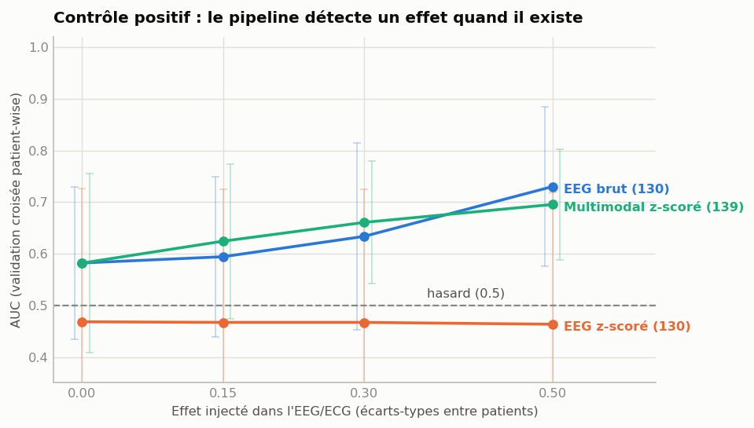

# NeuroRéponse — rTMS + LSTM (PFE 2026)

Research prototype that studies whether response to **rTMS** treatment in major
depression can be predicted from neurophysiological signals (EEG, ECG) and
clinical variables, using an **LSTM** with patient-wise cross-validation.

> Repository: `NeuroReponse` (ASCII — GitHub mangles accents). The project is
> written **NeuroRéponse** everywhere it is read by a human.

It runs on **real data**: the public TDBRAIN rTMS-in-MDD cohort (132 treated
patients, 26-channel EEG + ECG), alongside two simulated cohorts used as
controls. Built from `Description et Conception (Version0) (3).docx` — every UML
class in the design document is implemented and exercised by tests or the app.

## The headline result is negative, and that is the point

Response to rTMS is **not predictable at better than chance** from a single
baseline resting recording, whatever you feed the model:

| variant | cohort | variables | AUC (5-fold, patient-wise) | exactitude | taux de base |
|---|---|---|---|---|---|
| `sim_rtms` | simulée appariée | 4 cliniques | **0.629** ± 0.115 | 0.636 | 0.636 |
| `tdbrain_rtms` | **réelle** | 4 cliniques | **0.574** ± 0.111 | 0.628 | 0.629 |
| `sim_multi` | simulée appariée | 139 (clin. + EEG + ECG) | 0.582 ± 0.173 | 0.674 | 0.636 |
| `tdbrain_multi` | **réelle** | 139 (clin. + EEG + ECG) | 0.488 ± 0.087 | 0.621 | 0.629 |



Three things to read off this:

- **No variant beats its base rate on accuracy.** All sit at the majority-class
  rate; the confusion matrices have an empty non-responder column. The models
  predict "responder" for nearly everyone.
- **4 clinical variables beat 139 multimodal ones**, on both cohorts. Adding 135
  largely uninformative columns dilutes the few informative ones across only 132
  patients.
- **Differences between variants are the size of the fold standard deviation.**
  Ranking them by AUC would be commenting on noise.

**Age is the only real predictor found anywhere in this project** — AUC 0.610
alone on the real cohort, dominating permutation importance (+0.128). The rTMS
protocol scores *negative* (−0.020); it is confounded with age (p=0.013) and
carries essentially no information about response (χ² p=0.885, MI 0.0004 nats).
Use it to stratify, never as a feature.

### The proposed equations were implemented and tested. They do not change it.

A "physics-informed" multi-scale framework (Maxwell → Hodgkin-Huxley → Kuramoto →
PLV/coherence → LSTM, plus a Kalman/MPC loop and an exploratory Tesla 3-6-9
harmonic hypothesis) was proposed for this project. The testable part is
implemented in `src/preprocessing/connectivity.py` and evaluated by
`python -m src.reporting.hypo_ablation --regression`, which runs the ablation
ladder that framework itself specifies — each rung adding exactly one block, on
the same patients and the same folds.

**Three feature families the reference study never computes** now exist:
synchronisation (PLV, magnitude-squared coherence, the Kuramoto order parameter
and its metastability — 30 columns), complexity (spectral entropy, the 1/f
aperiodic exponent as an E:I proxy, frontal alpha asymmetry, individual alpha
frequency — 6), and the 3-6-9 harmonic ratio (4). Band power is blind to phase,
so none of this is expressible in the 130 columns the study uses.

| rung | variables | AUC | 95 % CI | PR-AUC | bal. acc | signal |
|---|---|---|---|---|---|---|
| A | EEG alone (the study's feature set, 130) | 0.456 | [0.36, 0.55] | 0.604 | 0.461 | — |
| B | ECG alone (HRV, 5) | 0.394 | [0.30, 0.50] | 0.567 | 0.488 | — |
| SYNC | synchronisation alone (30) | 0.491 | [0.39, 0.59] | 0.644 | 0.453 | — |
| CPLX | complexity alone (6) | 0.489 | [0.38, 0.59] | 0.630 | 0.504 | — |
| G | everything but 3-6-9 (175) | 0.467 | [0.36, 0.58] | 0.635 | 0.496 | — |
| H369 | everything + 3-6-9 (179) | 0.468 | [0.37, 0.57] | 0.622 | 0.487 | — |
| | *no-skill reference* | *0.500* | | *0.629* | *0.500* | |

Every rung is at chance; every PR-AUC is **below** the base rate. A rung counts
as signal only if its AUC interval excludes 0.5, its permutation p clears 5 %,
its balanced accuracy exceeds 0.5 *and* it predicted both classes — accuracy is
deliberately excluded, because the all-positive predictor scores 0.629 accuracy
and 0.768 F1 on this cohort. None qualifies.

**The decisive control.** Retraining the best rung end to end on shuffled labels
reaches 0.441 / 0.512 / 0.448 against a real 0.491 — indistinguishable. A
permutation p computed *after* prediction would not have caught this; it once
reported p = 0.010 for numbers produced by a leak in this very project.

**But the instrument works, and that is what makes the null worth reporting.**
The same features reproduce three replicated age effects with the correct sign:
the 1/f exponent flattens with age (r = −0.335, p = 8.7e-5), individual alpha
frequency declines (r = −0.174, p = 0.046), alpha-band phase synchrony declines
(r = −0.295, p = 6.0e-4). Mean exponent 1.35 and mean IAF 9.44 Hz are textbook
values. "Connectivity predicts nothing" and "connectivity was computed wrongly"
produce identical tables; only a positive control separates them.

**Two hypotheses were refuted rather than left open.**

- *The electromagnetic layer (B/E/J) is empty on this cohort, not merely
  unimplemented.* Coil current, coil geometry and tissue conductivity are all
  unpublished, so every derivable quantity reduces to a function of the protocol
  integer. Proof by rank: adding three physics columns to `[1 | protocol]` leaves
  the rank at 2.
- *The 3-6-9 hypothesis fails its own falsification criterion.* Adding the block
  moves AUC by +0.0017, inside the confidence interval; and its best feature —
  r = +0.239, p = 0.006 against BDI-II reduction, exactly the kind of hit that
  becomes a finding when reported uncorrected — rises to q = 0.235 under
  Benjamini-Hochberg. Zero of 40 features survive FDR on any of the three
  outcomes.

### Why this is a result and not a broken pipeline

`src/data/simulator_matched.py` reproduces the real cohort's shape and statistics
exactly, with one knob — `effect_size` — as the only route by which label
information enters the neurophysiological signal. Sweeping it through the *same*
feature construction and the *same* cross-validation asks whether the pipeline
can detect an effect at all.



| arm | 0.00 | 0.15 | 0.30 | 0.50 |
|---|---|---|---|---|
| EEG **raw** (130) | 0.582 | 0.594 | 0.634 | **0.730** |
| EEG **z-scored** (130) | 0.468 | 0.467 | 0.467 | **0.463** |
| Multimodal z-scored (139) | 0.582 | 0.624 | 0.661 | 0.695 |

The raw arm climbs: the pipeline detects an effect when one exists, so the flat
real-data result is a property of the data and not of broken plumbing.

**The z-scored arm is dead flat — and that is a finding in itself.** The simulator
raises responders' alpha by a *per-patient constant*, applied identically to every
epoch. Per-patient z-scoring centres each patient on their own epochs, so it
subtracts exactly the quantity that carries the label. A between-patient effect
cannot survive within-patient normalisation — the same mechanism that keeps the
HRV block out of `zscore_epochs`. It also means the multimodal curve's climb comes
from **HRV**, which is never z-scored, and not from EEG at all.

This does not soften the negative result: on *real* data both raw and z-scored EEG
sit at chance (0.465 / 0.467). What it says is that the z-scored simulated arm was
never capable of demonstrating detection either way, so it could not have served
as a control. `tests/test_effect_sweep.py` pins the mechanism directly on the
features, without retraining.

Regenerate with `python -m src.reporting.effect_sweep` (writes
`docs/strategy/effect_sweep.csv`), or `--from-csv` to redraw the figure alone. It
trains nothing that is saved — the four checkpoints stay untouched.

## Status

| Phase | Description | Status |
|-------|-------------|--------|
| 1 | Foundation: domain classes, SQLite persistence, tests | done |
| 2 | Simulated dataset (100 patients × 10 sessions) | done |
| 3 | Preprocessing pipeline (filtering, features, windowing) | done |
| 4 | LSTM training + patient-wise cross-validation | done |
| 5 | Streamlit clinician interface | done |
| 6 | Results notebooks, figures, lint clean-up | done |
| — | **Real-data track**: TDBRAIN loader/seeder, ECG/HRV, clinical loop, follow-up | done |
| — | **2×2 comparison**: 4 models, matched simulator, comparison page in the app | done |

**218 tests passing**, lint clean (`ruff check src/`), eight executable
notebooks, seven-page Streamlit app, generated DOCX guides.

## Three cohorts, three databases

They are kept in separate SQLite files on purpose — simulated and real patients
must never share a table, and each model is trained on its own feature contract.

| cohort | database | sequence axis | models |
|---|---|---|---|
| Simulé — séquentiel | `recherche.sqlite3` | 10 **treatment sessions** | `lstm_v1` |
| Simulé — apparié TDBRAIN | `recherche_sim_matched.sqlite3` | 8 **epochs** of one baseline recording | `sim_rtms`, `sim_multi` |
| TDBRAIN (réel) | `recherche_tdbrain.sqlite3` | 8 **epochs** of one baseline recording | `tdbrain_rtms`, `tdbrain_multi` |

The first two are both "simulated" but are different cohorts of different shape.
The sequential one is the only place where the LSTM accumulates evidence *across*
sessions — the clinical loop depends on it. The matched one reproduces TDBRAIN's
structure and is what the 2×2's simulated variants were fit on.

## Quick start

> **Python 3.11 – 3.14, 64-bit.** Not 3.15 or newer — see [Stack](#stack).
> `requirements.txt` refuses to install on an unsupported interpreter rather
> than failing halfway through a source build.

```powershell
python -V                                    # must report 3.11.x - 3.14.x
python -m venv .venv
.\.venv\Scripts\Activate.ps1

pip install -r requirements.txt
# torch wheel comes from a separate index:
pip install torch --index-url https://download.pytorch.org/whl/cpu

python -m pytest -q                          # 218 tests
python -m src.data.simulator                 # generate the sequential simulated dataset
python -m src.reporting.sequence_sweep       # does cumulating sessions help? (page 7)
python -m src.models.train_article --real-only --n-splits 10 --repeats 10
python -m src.data.seeder                    # load it into SQLite
python -m src.data.tdbrain_seeder --matched  # the matched simulated cohort
streamlit run src/app/main.py                # launch the clinician app
```

Then open <http://localhost:8501>. The sidebar selects **cohort × feature set**;
every page follows that selection.

The real cohort needs the gated TDBRAIN download (~14.5 GB, see
[`docs/tdbrain.md`](docs/tdbrain.md)) and is seeded from the command line, since
it decodes 132 BDF recordings:

```powershell
python -m src.data.tdbrain_seeder --root "data/tdbrain/.../TDBRAIN_Dataset_V3_1" `
    --db recherche_tdbrain.sqlite3
python -m src.models.train_all --root "data/tdbrain/.../TDBRAIN_Dataset_V3_1"
```

## The app

| Page | Purpose |
|---|---|
| Accueil | cohort/model selection, database state |
| 1 · Patients | patient records, clinical history |
| 2 · Sessions | rTMS sessions (or resting epochs) and their signals |
| 3 · Training | patient-wise cross-validation and final model, per variant |
| 4 · Predictions | response prediction for one patient + PDF export |
| 5 · Suivi | evolution across all sessions, clinical vs model trajectory |
| 6 · Boucle clinique | record → predict → adjust the stimulator → repeat |
| 7 · Comparaison | the four models side by side, read from `comparison.json` |

Model inputs are rebuilt in exactly one place (`src/app/inference.py`), and every
checkpoint ships a JSON **feature contract** describing how its inputs were
built. Predictions refuse to run on a mismatch rather than silently feeding the
model the wrong vector.

## Notebooks

| Notebook | Purpose |
|---|---|
| `01_data_exploration` | the simulated dataset (signals, labels, alpha trajectory) |
| `02_model_training` | LSTM with patient-wise 5-fold CV |
| `03_results_analysis` | ROC, confusion matrix, OOF distribution, feature importance |
| `04_tdbrain_real_data` | loading and characterising the real cohort |
| `05`–`08` | one report per variant of the 2×2 |

Notebooks 05–08 are **generated** by `python -m src.reporting.build_notebooks` —
edit the builder, never the `.ipynb`. 06 and 08 fall back to a synthetic fixture
when the gated data is absent, so they execute on any machine.

## Repository layout

```
src/
  domain/         # the 8 UML classes (Patient, SessionRTMS, ...)
  data/           # simulators, TDBRAIN loader, seeders, modality assembly
  preprocessing/  # filters, features, windowing, end-to-end pipeline
  models/         # PyTorch LSTM, patient-wise CV, the 4-variant registry
  db/             # SQLAlchemy schema + Repository (= BaseDeDonnées UML class)
  app/            # Streamlit app (7 pages) + shared inference
  reporting/      # figures, notebook builder, DOCX guides, clinical loop logic
notebooks/        # 01-04 plus one generated report per variant
tests/            # pytest — 218 tests
docs/             # tdbrain.md, figures/, generated guides
```

## UML → code mapping

| UML class                | Module                                            |
|--------------------------|---------------------------------------------------|
| Patient                  | `src/domain/patient.py`                           |
| SessionRTMS              | `src/domain/session_rtms.py`                      |
| SignalNeurophysiologique | `src/domain/signal_neuro.py`                      |
| Preprocessing            | `src/domain/preprocessing.py` (+ `src/preprocessing/`) |
| RTMSParameters           | `src/domain/rtms_parameters.py`                   |
| ModeleLSTM               | `src/domain/lstm_model.py` (+ `src/models/`)      |
| Prediction               | `src/domain/prediction.py`                        |
| ClinicianInterface       | `src/domain/clinician.py` + Streamlit app         |
| BaseDeDonnées            | `src/db/repository.py` (SQLAlchemy + SQLite)      |

## Stack

- **Python 3.11 – 3.14, 64-bit** (developed and tested on 3.14). **Not 3.15+**:
  pandas, torch, scikit-learn, matplotlib and pyarrow publish no cp315 wheels, so
  pip falls back to compiling them from source and dies in Meson/MSVC. The first
  line of `requirements.txt` is a deliberate guard that fails immediately with a
  readable message instead. Raise its bound once those projects ship 3.15 wheels.
- **PyTorch (CPU)** — TensorFlow ships no Python 3.14 wheels; the design doc accepts either
- **SQLAlchemy 2.0** + **SQLite** for persistence
- **MNE** for reading BioSemi BDF recordings
- **Streamlit** + **Plotly** for the clinician UI
- **scikit-learn** (`GroupKFold`, metrics), **SciPy** (filtering, Welch PSD)
- **reportlab** / **python-docx** for PDF and DOCX export

## Methodological guarantees

Enforced by tests, not by convention:

- **Cross-validation is always patient-wise** (`GroupKFold` on patient id) —
  `test_groupkfold_keeps_patients_separated`.
- **Normalisation is per-patient, never across patients** —
  `test_pipeline_no_cross_patient_leakage`.
- **The HRV block is never z-scored**: it is constant across epochs by
  construction, so z-scoring would collapse it to zero and delete the modality
  while every shape assertion still passed —
  `test_zscoring_does_not_blank_the_hrv_block`.
- **A recording uploaded in the clinical loop goes through the training loader**,
  not a parallel implementation —
  `test_snapshot_matches_what_the_training_loader_would_produce`.
- **A patient rebuilt from SQLite reproduces the training feature vector
  exactly** — `test_inference_clinical.py` (verified at 0.0 maximum absolute
  difference across the full 139-column tensor).
- **Every Streamlit page renders** — `test_app_pages.py` runs them through
  `AppTest`, because pages are scripts nothing imports.

## The article-aligned arm

The TDBRAIN track was built from Arteaga et al., *"Multiband EEG signatures
decoded using machine learning for predicting rTMS treatment response in MDD"*
([PMC12981298](https://pmc.ncbi.nlm.nih.gov/articles/PMC12981298/)). That study
reports r = 0.401 (protocol 1) and r = 0.255 (protocol 2) on a **continuous**
target, with **one model per rTMS protocol**. This project's original 2×2 answers
a different question — a pooled binary responder label — so the two cannot be
compared directly.

`python -m src.models.train_article --real-only --n-splits 10 --repeats 10`
trains six checkpoints that match the study's setup: ΔBDI as the target, protocols separated, Pearson r with
a 100-draw permutation test, on both the real cohort and the matched simulated
control. Results render at the bottom of page 7, in their own table.

**Measured result** (10 repetitions of 10-fold patient-wise CV, the study's own
protocol; preprocessing aligned to its Methods — 0.01–50 Hz, 50 Hz notch, common
average reference):

| variant | n | features | r (out-of-fold) | p (perm.) | r partial | R² | baseline `bdi_pre` alone |
|---|---|---|---|---|---|---|---|
| `tdbrain_p1_eeg_reg` | 44 | 130 (EEG only) | −0.373 | 0.990 | −0.370 | −0.370 | **+0.500** |
| `tdbrain_p1_clin_reg` | 44 | 4 (clinical) | −0.192 | 0.861 | −0.116 | −0.389 | **+0.500** |
| `tdbrain_p1_multi_reg` | 44 | 139 | −0.215 | 0.931 | −0.107 | −0.386 | **+0.500** |
| `tdbrain_p2_eeg_reg` | 88 | 130 (EEG only) | −0.419 | 1.000 | −0.403 | −0.251 | **+0.360** |
| `tdbrain_p2_clin_reg` | 88 | 4 (clinical) | −0.313 | 1.000 | −0.292 | −0.268 | **+0.360** |
| `tdbrain_p2_multi_reg` | 88 | 139 | −0.334 | 1.000 | −0.316 | −0.263 | **+0.360** |

`*_eeg_reg` is the variant that matches the study, whose model receives **no**
clinical variables. Reading it against `*_clin_reg` on the same arm is the only
comparison that says whether the EEG contributed anything — the multimodal row
takes baseline BDI-II as an *input*, so its r cannot separate the two.

Nothing predicts. Every R² is negative (worse than emitting the cohort mean), and
predictions vary by under one BDI-II point against a target spread of 12.75.

### A leak that briefly said otherwise

An earlier run of this table reported r = +0.606 on protocol 1 — above the
study's r = 0.401. It was an artefact. `cross_validate` handed the outer held-out
fold to `train_one_fold` as its **early-stopping** set, so every fold's weights
were selected on the patients that fold was then scored on. Retraining the whole
pipeline on **shuffled** labels reproduced r = +0.65, +0.46, +0.53 — where the
true signal is zero by construction.

The permutation test did not catch it: it shuffles labels *after* prediction, so
it only checks the statistic, and it happily returned p = 0.010. Early stopping
now watches a patient-wise split carved out of the training fold
(`_inner_split`), and two tests pin it —
`test_early_stopping_never_watches_the_outer_fold` and
`test_shuffled_labels_do_not_produce_a_correlation`. Any future claim of signal
in this project has to clear the shuffled-label retrain, not the p-value.

> The 2×2's stored numbers in `comparison.json` predate both this fix and the
> preprocessing change. Re-run `train_all` before quoting them alongside this table.

Two methodological gaps with the study remain, and closing them is the next step:
it decomposes the signal with itEMD and learns sparse spatio-temporal filters
(SBLEST) where this project averages band power per channel, and its protocol 2
has 73 patients against 88 here — a difference that is **not** an indication
filter (that would break the exact 44 = 44 match on protocol 1) and cannot be
identified from the published metadata.

## Honest note on the metrics

Two different AUCs appear in the reports: the **mean of per-fold AUCs** (verdict
panels) and the **pooled out-of-fold AUC** (ROC curves). Both are legitimate,
they do not match, and the labels say which is which.

**Does cumulating sessions help?** The 2×2 cannot say: both its cohorts are
baseline-only, so "more timesteps" means more windows of the same two minutes.
Only the sequential cohort has real visits. Running the same patient-wise CV on
that cohort truncated to the first *k* sessions (`python -m
src.reporting.sequence_sweep`, rendered at the bottom of page 7) gives AUC
**0.923 → 0.996** and accuracy 0.83 → 0.98 from k=1 to k=10, with the fold
std collapsing **0.109 → 0.008**. Extra sessions do not just raise the mean,
they stabilise the estimate — which is the architectural argument for the
clinical loop. Read the curve's *shape*, not its height: see the caveat below.

The legacy sequential simulated cohort reaches AUC ≈ 0.99. That number is
**artificial** — that simulator deliberately injects a clean alpha-power
biomarker so the pipeline can be tested end to end. It proves the plumbing works,
not that anything is predictable. The matched simulator exists precisely because
the first one was too easy: it reproduces the real cohort's difficulty instead.

On the real cohort, treat single-baseline response prediction as a **known-hard
negative result**, not a bug to be fixed. The clinical loop and the follow-up page
demonstrate the *workflow*; they carry on-screen warnings that the underlying
model is at chance and must not guide a therapeutic decision.
